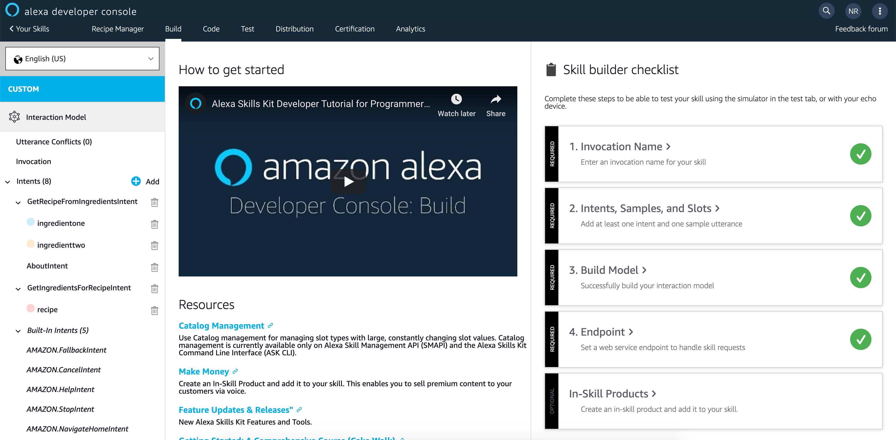
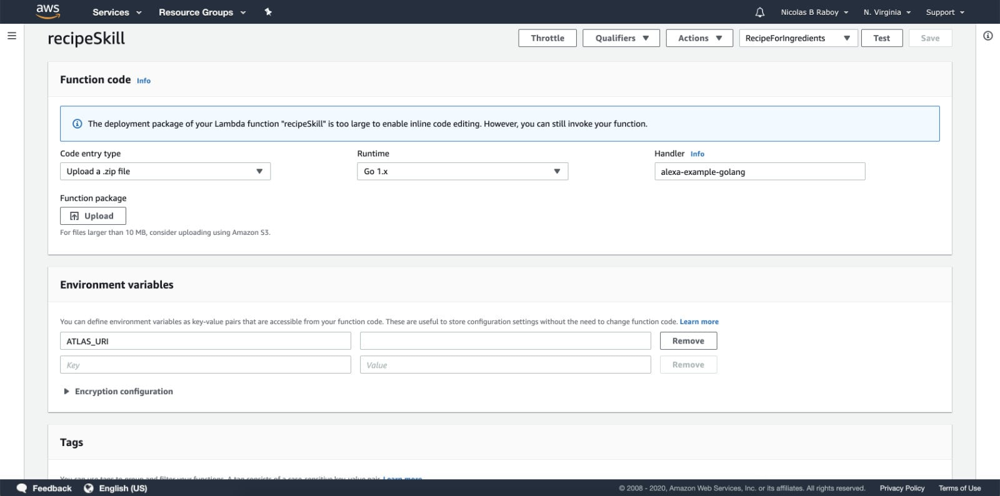

# Developing Alexa Skills with MongoDB and Golang

The popularity of Amazon Alexa and virtual assistants in general is no question, huge. Having a web application and mobile application isn't enough anymore, and now you need to start supporting voice operated applications.

So what does it take to create something for Alexa? How different is it from creating a web application?

In this tutorial we're going to see how to create an Amazon Alexa Skill that interacts with a MongoDB cluster using the Go programming language (Golang) and AWS Lambda.

## The Requirements

There are a few requirements that must be met prior to starting this tutorial:

- Golang must be installed and configured
- A MongoDB Atlas cluster

If you don't have a [MongoDB Atlas](https://www.mongodb.com/cloud) cluster, you can configure one for free. For this example an M0 cluster is more than sufficient.

> Using promotional code NRABOY200 will give you $200 in premium credit on your Atlas account for a more powerful cluster beyond the forever free M0 cluster.

Having an Amazon Echo or other Amazon Alexa enabled device is not necessary to be successful with this tutorial. Amazon offers a really great simulator that can be used directly in the web browser.

## Designing an Alexa Skill with an Invocation Term and Sample Utterances

When it comes to building an Alexa Skill, it doesn't matter if you start with the code or the design. For this tutorial we're going to start with the design, directly in the [Amazon Developer Portal](https://developer.amazon.com) for Alexa.

Sign into the portal and choose to create a new custom Skill. After creating the Skill, you'll be brought to a dashboard with several checklist items:



In the checklist, you should take note of the following:

- Invocation Name
- Intents, Samples, and Slots
- Endpoint

There are other items, one being optional and the other being checked naturally as the others complete.

The first step is to define the invocation name. This is the name that users will use when they speak to their virtual assistant. It should not be confused with the Skill name because the two do not need to match. The Skill name is what would appear in the online marketplace.

For our invocation name, let's use **recipe manager**, something that is easy to remember and easy to pronounce. With the invocation name in place, we can anticipate using our Skill like the following:

```plaintext
Alexa, ask Recipe Manager to INTENT
```

The user would not literally speak **INTENT** in the command. The intent is the command that will be defined through sample utterances, also known as sample phrases or data. You can, and probably should, have multiple intents for your Skill.

Let's start by creating an intent titled **GetIngredientsForRecipeIntent** with the following sample utterances:

```plaintext
what ingredients do i need for {recipe}
what do i need to cook {recipe}
to cook {recipe} what ingredients do i need
```

There are a few things to note about the above phrases:

- The `{recipe}` tag is a slot variable which is going to be user defined when spoken.
- Every possible spoken phrase to execute the command should be listed.

Alexa operates from machine learning, so the more sample data the better. When defining the `{recipe}` variable, it should be assigned a type of `AMAZON.Food`.

When all said and done, you could execute the intent by doing something like:

```plaintext
Alexa, ask Recipe Manager what do I need to cook Chocolate Chip Cookies
```

Having one intent in your Alexa Skill is no fun, so let's create another intent with its own set of sample phrases. Choose to create a new intent titled `GetRecipeFromIngredientsIntent` with the following sample utterances:

```plaintext
what can i cook with {ingredientone} and {ingredienttwo}
what are some recipes with {ingredientone} and {ingredienttwo}
if i have {ingredientone} and {ingredienttwo} what can i cook
```

This time around we're using two slot variables instead of one. Like previously mentioned, it is probably a good idea to add significantly more sample utterances to get the best results. Alexa needs to be able to process the data to send to your Lambda function.

At this point in time, the configuration in the Alexa Developer Portal is about complete. The exception being the endpoint which doesn't exist yet.

## Building a Lambda Function with Golang and MongoDB

Alexa, for the most part should be able to direct requests, so now we need to create our backend to receive and process them. This is where Lambda, Go, and MongoDB come into play.

Assuming Golang has been properly installed and configured, create a new project within your **$GOPATH** and within that project, create a **main.go** file. As boilerplate to get the ball rolling, this file should contain the following:

```go
package main

func main() { }
```

With the boilerplate code added, now we can install the MongoDB Go driver. To do this, you could in theory do a `go get`, but the preferred approach as of now is to use the [dep](https://github.com/golang/dep) package management tool for Golang. To do this, after having installed the tool, execute the following:

```bash
dep init
dep ensure -add "go.mongodb.org/mongo-driver/mongo"
```

We're using `dep` so that way the version of the driver that we're using in our project is version locked.

In addition to the MongoDB Go driver, we're also going to need to get the [AWS Lambda SDK for Go](https://github.com/aws/aws-lambda-go) as well as an [unofficial SDK for Alexa](https://github.com/arienmalec/alexa-go), since no official SDK exists. To do this, we can execute:

```bash
dep ensure -add "github.com/arienmalec/alexa-go"
dep ensure -add "github.com/aws/aws-lambda-go/lambda"
```

With the dependencies available to us, we can modify the project's **main.go** file. Open the file and add the following code:

```go
package main

import (
	"context"
	"log"
	"os"
	"time"

	"go.mongodb.org/mongo-driver/mongo"
	"go.mongodb.org/mongo-driver/mongo/options"
)

type Connection struct {
	database *mongo.Database
}

func main() {
	client, err := mongo.NewClient(options.Client().ApplyURI(os.Getenv("ATLAS_URI")))
	if err != nil {
		log.Fatal(err)
	}
	ctx, _ := context.WithTimeout(context.Background(), 10*time.Second)
	err = client.Connect(ctx)
	if err != nil {
		log.Fatal(err)
	}
	defer client.Disconnect(ctx)
	database := client.Database("alexa")
	connection := Connection{
		database: database,
	}
}
```

In the `main` function we are creating a client using the connection string of our cluster. In this case, I'm using an environment variable on my computer that points to my MongoDB Atlas cluster. Feel free to configure that connection string however you feel the most confident.

Before attempting to connect, we are setting a generous timeout of ten seconds. Upon connecting, we are getting a handle of an `alexa` database and storing it in a `Connection` data structure. If the `alexa` database doesn't exist, it will create one if we try to create data.

You can check out more information about connecting to MongoDB with the Go programming language in a [previous tutorial](https://www.mongodb.com/blog/post/quick-start-golang--mongodb--starting-and-setup) I wrote.

So why are we storing the database handle in a `Connection` data structure?

AWS Lambda behaves a little differently when it comes to web applications. Instead of running the `main` function and then remaining alive for as long as your server remains alive, Lambda functions tend to suspend or shutdown when they are not used. For this reason, we cannot rely on our connection being available and we also don't want to establish too many connections to our database in the scenario where our function hasn't shut down. To handle this, we can pass the connection from our `main` function to our logic function.

Let's make a change to see this in action:

```go
package main

import (
	"context"
	"log"
	"os"
	"time"

	"github.com/arienmalec/alexa-go"
	"github.com/aws/aws-lambda-go/lambda"
	"go.mongodb.org/mongo-driver/mongo"
	"go.mongodb.org/mongo-driver/mongo/options"
)

type Connection struct {
	database *mongo.Database
}

func (connection Connection) IntentDispatcher(ctx context.Context, request alexa.Request) (alexa.Response, error) {
	// Alexa logic here...
}

func main() {
	client, err := mongo.NewClient(options.Client().ApplyURI(os.Getenv("ATLAS_URI")))
	if err != nil {
		log.Fatal(err)
	}
	ctx, _ := context.WithTimeout(context.Background(), 10*time.Second)
	err = client.Connect(ctx)
	if err != nil {
		log.Fatal(err)
	}
	defer client.Disconnect(ctx)
	database := client.Database("alexa")
	connection := Connection{
		database: database,
	}
	lambda.Start(connection.IntentDispatcher)
}
```

Notice in the above code that we've added a `lambda.Start` call in our `main` function that points to an `IntentDispatcher` function. We're designing this function to use the connection information established in the `main` function, which based on our Lambda knowledge, may not run every time the function is executed.

So we've got the foundation to our Alexa Skill in place. Now we need to design the logic for each of our intents that were previously defined in the Alexa Developer Portal.

Since this is going to be a recipe related Skill, let's model our MongoDB documents like the following:

```json
{
    "_id": ObjectID("234232358943"),
    "name": "chocolate chip cookies",
    "ingredients": [
        "flour",
        "egg",
        "sugar",
        "chocolate"
    ]
}
```

There is no doubt that our documents could be more extravagant, but for this example it will work out fine. Within the MongoDB Atlas cluster, create the **alexa** database if it doesn't already exist and add a document modeled like the above in a **recipes** collection.

In the `main.go` file of the project, add the following data structure:

```go
type Recipe struct {
	Id          primitive.ObjectID `bson:"_id"`
	Name        string             `bson:"name"`
	Ingredients []string           `bson:"ingredients"`
}
```

With the MongoDB Go driver, we can annotate Go data structures with BSON so that way we can easily map between the two. It essentially makes our lives a lot easier when working with MongoDB and Go.

Let's circle back to the `IntentDispatcher` function:

```go
func (connection Connection) IntentDispatcher(ctx context.Context, request alexa.Request) (alexa.Response, error) {
	var response alexa.Response
	switch request.Body.Intent.Name {
	case "GetIngredientsForRecipeIntent":
	case "GetRecipeFromIngredientsIntent":
	default:
		response = alexa.NewSimpleResponse("Unknown Request", "The intent was unrecognized")
	}
	return response, nil
}
```

Remember the two intents from the Alexa Developer Portal? We need to assign logic to them.

Essentially, we're going to do some database logic and then use the `NewSimpleResponse` function to create a response the the results.

Let's start with the `GetIngredientsForRecipeIntent` logic:

```go
case "GetIngredientsForRecipeIntent":
    var recipe Recipe
    recipesCollection := connection.database.Collection("recipes")
    recipeName := request.Body.Intent.Slots["recipe"].Value
    if recipeName == "" {
        return alexa.Response{}, errors.New("Recipe name is not present in the request")
    }
    if err := recipesCollection.FindOne(ctx, bson.M{"name": recipeName}).Decode(&recipe); err != nil {
        return alexa.Response{}, err
    }
    response = alexa.NewSimpleResponse("Ingredients", strings.Join(recipe.Ingredients, ", "))
```

In the above snippet, we are getting the slot variable that was passed and are issuing a `FindOne` query against the collection. The filter for the query says that the `name` field of the document must match the recipe that was passed in as a slot variable.

If there was a match, we are serializing the array of ingredients into a string and are returning it back to Alexa. In theory, Alexa should then read back the comma separated list of ingredients.

Now let's take a look at the `GetRecipeFromIngredientsIntent` intent logic:

```go
case "GetRecipeFromIngredientsIntent":
    var recipes []Recipe
    recipesCollection := connection.database.Collection("recipes")
    ingredient1 := request.Body.Intent.Slots["ingredientone"].Value
    ingredient2 := request.Body.Intent.Slots["ingredienttwo"].Value
    cursor, err := recipesCollection.Find(ctx, bson.M{"ingredients": bson.D{{"$all", bson.A{ingredient1, ingredient2}}}})
    if err != nil {
        return alexa.Response{}, err
    }
    if err = cursor.All(ctx, &recipes); err != nil {
        return alexa.Response{}, err
    }
    recipeList := ""
    for _, recipe := range recipes {
        recipeList += recipe.Name
    }
    response = alexa.NewSimpleResponse("Recipes", recipeList)
```

In the above snippet, we are taking both slot variables that represent ingredients and are using them in a `Find` query on the collection. This time around we are using the `$all` operator because we want to filter for all recipes that contain both ingredients anywhere in the array.

With the results of the `Find`, we can create a string to be returned as part of the Alexa response.

If you'd like more information on the `Find` and `FindOne` commands for Go and MongoDB, check out my [previous tutorial](https://www.mongodb.com/blog/post/quick-start-golang--mongodb--how-to-read-documents) on the subject.

While it might seem simple, the code for the Alexa Skill is actually complete. We've coded scenarios for each of the two intents that we've set up in the Alexa Developer Portal. We could improve upon what we've done or create more intents, but it is out of the scope of what we want to accomplish.

Now that we have our application, we need to build it for Lambda.

Execute the following commands:

```bash
GOOS=linux go build
zip handler.zip ./project-name
```

So what's happening in the above commands? First we are building a Linux compatible binary. We're doing this because if you're developing on Mac or Windows, you're going to end up with a binary that is incompatible. By defining the operating system, we're telling Go what to build for.

For more information on cross-compiling with Go, check out my [previous tutorial](https://www.thepolyglotdeveloper.com/2017/04/cross-compiling-golang-applications-raspberry-pi/) on the subject.

Next, we are creating an archive of our binary. It is important to replace the `project-name` with that of your actual binary name. It is important to remember the name of the file as it is used in the Lambda dashboard.



When you choose to create a new Lambda function within AWS, make sure Go is the development technology. Choose to upload the ZIP file and add the name of the binary as the handler.

Now it comes down to linking Alexa with Lambda.

Take note of the **ARN** value of your Lambda function. This will be added in the Alexa Portal. Also, make sure you add the Alexa Skills Kit as a trigger to the function. It is as simple as selecting it from the list.

Navigate back to the Alexa Developer Portal and choose the **Endpoint** checklist item. Add the ARN value and choose to build the Skill.

When the Skill is done building, you can test it using the simulator that Amazon offers as part of the Alexa Developer Portal.

## Conclusion

You just saw how to build an Alexa Skill with [MongoDB](https://www.mongodb.com), Golang, and AWS Lambda. It is great to know how to develop applications for voice assistants like Alexa because they are becoming increasingly popular, and the good news is that they aren't any more difficult than writing standard applications.

As previously mentioned, MongoDB Atlas makes pairing MongoDB with Lambda and Alexa very convenient. You can use the free tier or upgrade to something better with some promotional credits using coupon NRABOY200.

If you'd like to expand your Alexa with Go knowledge and get more practice, check out a previous tutorial I wrote titled [Build an Alexa Skill with Golang and AWS Lambda](https://www.thepolyglotdeveloper.com/2018/10/build-alexa-skill-golang-aws-lambda/).